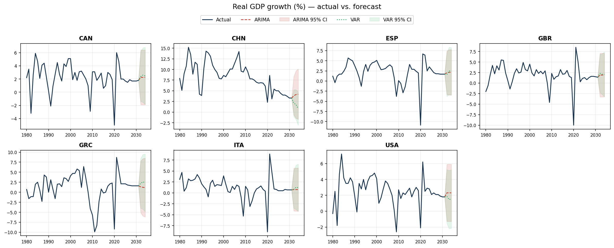
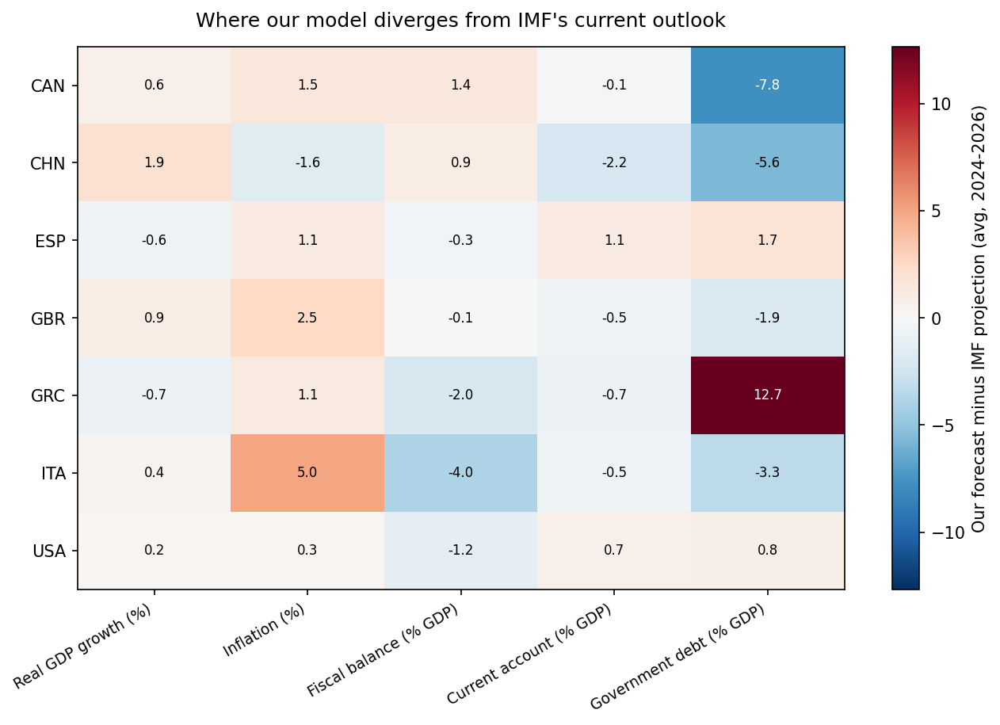
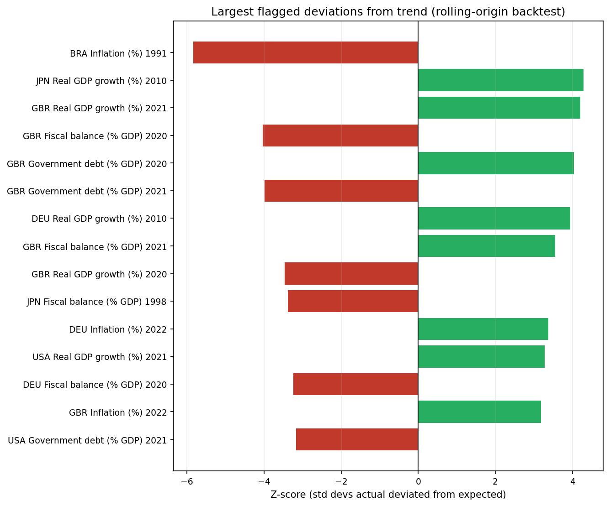

# IMF Macro Forecasting Assistant

An agentic pipeline that pulls IMF World Economic Outlook (WEO) macro data,
generates statistical forecasts, flags meaningful deviations from trend, and
uses an LLM to draft a plain-English briefing on the results.

## Why this project

Built to develop hands-on macroeconomic modeling and forecasting skills using
real IMF data, and to explore how agentic AI tools can support macro analysis
and reporting workflows.

## Pipeline

1. **Data** — pull WEO indicators (real GDP growth, inflation, fiscal balance,
   current account, government debt) via the public IMF DataMapper API, for
   Italy, Greece, Spain, Canada, UK, China, and the US.
2. **Forecast** — fit ARIMA/VAR models per country and indicator.
3. **Anomaly flagging** — flag cases where actuals deviate meaningfully from
   forecast/trend (historical backtest).
4. **IMF comparison** — hold out recent years, forecast them independently,
   and compare to what the IMF itself currently projects for those same
   years - a present-tense check, not a historical one.
5. **Agent briefing** — an LLM takes the forecast output and flags and drafts
   a short, readable summary of what changed and why it matters.
6. **Visualization** — chart the forecasts, IMF comparison, and flagged
   anomalies for quick visual review.
7. **Accuracy metrics** — compute MAE/RMSE from both backtests, turning
   "the model seems reasonable" into a measured claim.

## Status

- [x] Data pipeline — `src/fetch_weo_data.py`
- [x] Forecasting module — `src/forecast.py` (ARIMA + VAR)
- [x] Anomaly detection — `src/anomaly_detection.py` (rolling-origin backtest)
- [x] IMF comparison — `src/compare_to_imf.py` (near-term hold-out check)
- [x] LLM briefing agent — `src/generate_briefing.py` (Claude API)
- [x] Visualization — `src/visualize.py`
- [x] Accuracy metrics — `src/model_accuracy.py` (MAE/RMSE)

## Charts

**Real GDP growth: actual history vs. ARIMA/VAR forecast, per country**


**Where our model diverges from IMF's current outlook**


**Largest flagged deviations from trend (rolling-origin backtest)**


## Project structure
## Setup

```bash
python -m venv venv
source venv/bin/activate       # Windows: venv\Scripts\activate
pip install -r requirements.txt
python src/fetch_weo_data.py   # pulls WEO data -> data/weo_macro_indicators.csv
python src/forecast.py         # generates forecasts -> data/forecasts.csv
python src/anomaly_detection.py  # flags deviations -> data/anomalies.csv
python src/compare_to_imf.py     # near-term check -> data/imf_comparison.csv
export ANTHROPIC_API_KEY="sk-ant-..."  # get one at console.anthropic.com/settings/keys
python src/generate_briefing.py  # drafts a readable summary -> data/briefing.md
python src/visualize.py          # generates charts -> charts/*.png
python src/model_accuracy.py     # computes MAE/RMSE -> data/accuracy_report.csv
```

`forecast.py` fits two models per country:
- **ARIMA(1,1,1)** — one model per indicator, univariate
- **VAR** — one model per country, jointly fitting all five indicators to
  capture cross-variable dynamics (e.g. how inflation and fiscal balance move
  together)

Both forecast types are written to `data/forecasts.csv` alongside the actuals,
tagged by `value_type`, so they can be compared directly.

`anomaly_detection.py` runs a rolling-origin backtest: at each year, it fits a
model on everything before it, forecasts one step ahead, and flags years where
the actual value deviates more than 2 standard deviations from what the model
expected. Note that WEO data blends true historical actuals with the IMF's own
forward projections with no flag distinguishing the two, so a flagged year
means "this diverged notably from a simple trend model" - worth a second look,
whether that's a real economic shock or a revised outlook.

`compare_to_imf.py` answers a different question: pretending we're standing at
the end of 2023, it forecasts 2024-2026 using only pre-2023 data, then compares
that forecast to what the IMF's own current WEO data shows for those same
years. This checks whether a simple model agrees with the IMF's own present-day
outlook, rather than testing against distant historical shocks.

`generate_briefing.py` is the agentic layer: it packages each country's latest
actuals, forecast trajectory, and any flagged anomalies into a prompt, sends it
to Claude, and writes the resulting plain-English briefing to `data/briefing.md`.
This turns raw model output into something a person (or a hiring manager
reading this repo) would actually want to read.

`model_accuracy.py` computes MAE (Mean Absolute Error) and RMSE (Root Mean
Squared Error) from both backtests: historical accuracy from
`anomaly_detection.py`'s rolling-origin test, and agreement with the IMF's
current outlook from `compare_to_imf.py`'s 2024-2026 hold-out. This replaces
"the model seems reasonable" with a specific, measured number - e.g. "our
1-year-ahead GDP growth forecasts are off by an average of X percentage
points historically."

## Data source

[IMF DataMapper API](https://www.imf.org/external/datamapper/api/help) —
public, no API key required. Indicators and country coverage per the IMF
World Economic Outlook database.

## License

MIT
